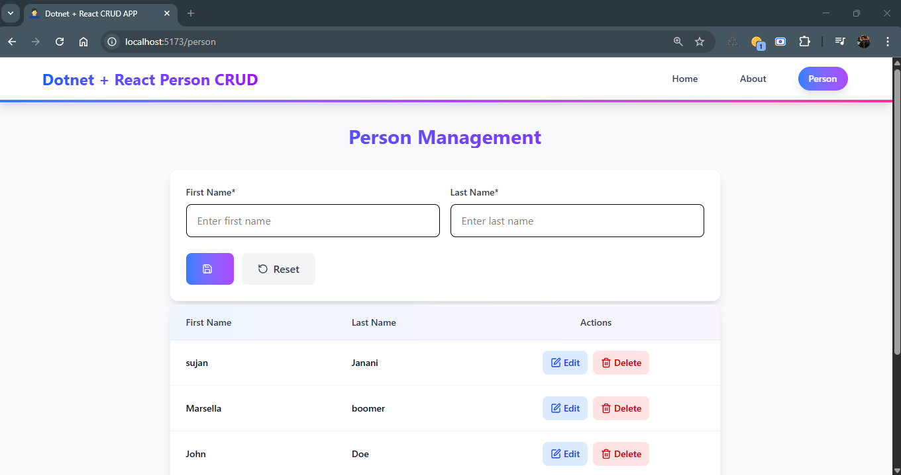

# Full stack crud application in .NET 9 and React 19

## Tech stack

- .NET 9 Web APIs (Backend)
- Entity framework core (ORM)
- Sqlite (database)
- React 19 (frontend)
- Lucide react (icons)
- React router (routing)
- React hook form (form and validation)
- React hot toast (toaster)

## How to run the project

1. Clone the project

```bash
git clone https://github.com/Sujan-Murugesh/ReactCrud
```

2. Change directory

```bash
cd ReactCrud
```

3. Visit backend project's directory

```bash
cd Backend/Backend/
```

4. Run migrations

```bash
 dotnet ef database update
```

5. Run backend project

```bash
 dotnet run
```
Keep backend project running. Open a new tab in terminal


6. Visit frontend project's directory

```bash
cd path-to-project-directory/

cd client

```

7. Install dependencies

```bash
npm i
```

8. Run project
   
```bash
npm run dev
```
9. Visit to the route `http://localhost:5173` in the browser.

**Note:** If you are running this project on linux, then you might get this error. I got this on linux mint however it was running fine in windows 11 machine. 


## screenshot


